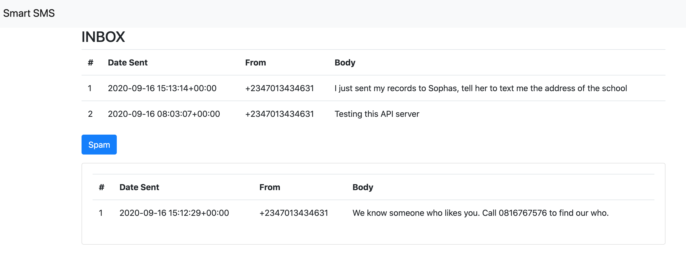

## An SMS Spam detector built with Keras, Flask and Twilio. 



-----------
To run this application, clone the repo:

```bash
 git clone https://github.com/risenW/spam-detector.git
 pip install -r requirements.txt
 cd spam-detection/src

```

To enable SMS capabilities, you need a [Twilio] account. Follow the steps below to set it up:

- [Sign up for your free Twilio trial](https://www.twilio.com/docs/usage/tutorials/how-to-use-your-free-trial-account#sign-up-for-your-free-twilio-trial)
- [Verify your personal phone number](https://www.twilio.com/docs/usage/tutorials/how-to-use-your-free-trial-account#verify-your-personal-phone-number)
- [Get your first Twilio phone number](https://www.twilio.com/docs/usage/tutorials/how-to-use-your-free-trial-account#get-your-first-twilio-phone-number)

Get your Twilio SID and Auth token from your account dashboard, and add it to the .env file

```
TWILIO_ACCOUNT_SID=<your_sid_goes_here>
TWILIO_AUTH_TOKEN=<your_token_goes_here>
```

Next, send a couple of Spam and Non-spam messages to your registered twilio phone number. Here are a few I tested after training:

**For Non-Spam:**

- I just sent my records to Sophia, tell her to text me the address of the school
- Testing this API server

**For Spam:**
- We know someone who likes you. Call 0816767576 to find out who.

Start the server by running `python app.py` in the src folder

**Extra:**

To retrain the model, run the [sms-spam-detection](src/sms-spam-detection.ipynb) notebook again. 
